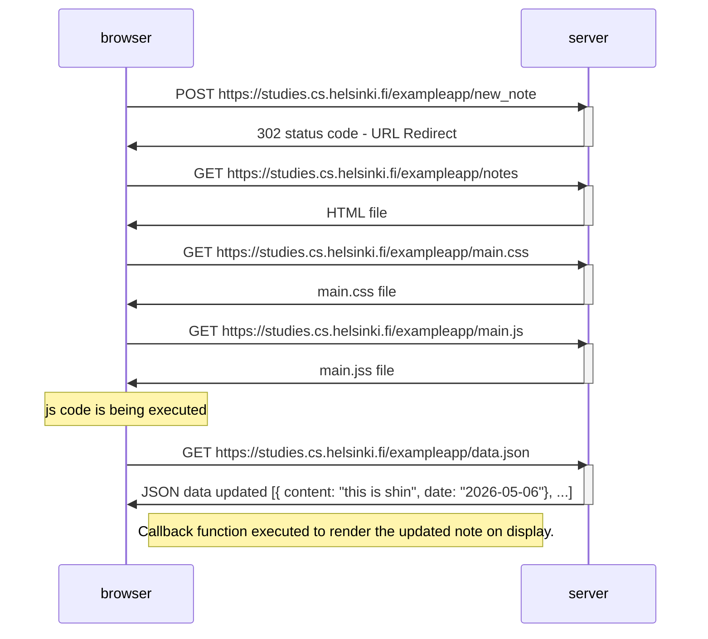

```mermaid
sequenceDiagram
participant browser
participant server

browser ->> server: POST https://studies.cs.helsinki.fi/exampleapp/new_note
activate server 
server ->> browser: 302 status code - URL Redirect
deactivate server

browser ->> server: GET https://studies.cs.helsinki.fi/exampleapp/notes
activate server
server ->> browser: HTML file
deactivate server

browser ->> server: GET https://studies.cs.helsinki.fi/exampleapp/main.css
activate server
server ->> browser: main.css file
deactivate server

browser ->> server: GET https://studies.cs.helsinki.fi/exampleapp/main.js
activate server
server ->> browser: main.jss file
deactivate server

Note over browser : js code is being executed 

browser ->> server:  GET https://studies.cs.helsinki.fi/exampleapp/data.json
activate server 
server ->> browser: JSON data updated [{ content: "this is shin", date: "2026-05-06"}, ...]
deactivate server 

Note right of browser: Callback function executed to render the updated note on display. 
```