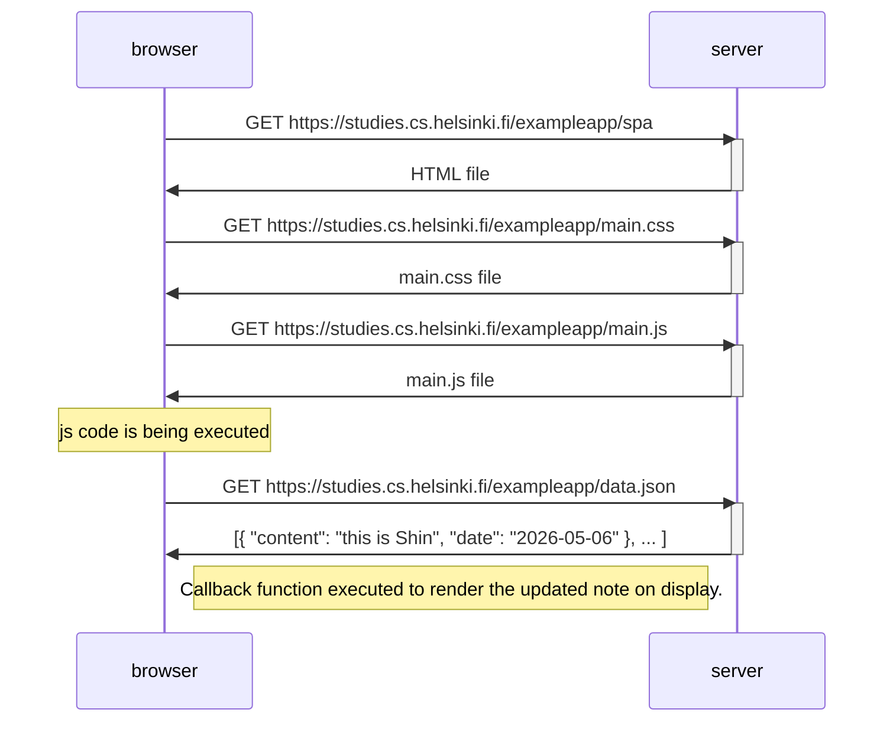

```mermaid
sequenceDiagram
participant browser
participant server

browser ->> server: GET https://studies.cs.helsinki.fi/exampleapp/spa 
activate server
server ->> browser: HTML file 
deactivate server

browser ->> server: GET https://studies.cs.helsinki.fi/exampleapp/main.css
activate server
server ->> browser: main.css file 
deactivate server

browser ->> server: GET https://studies.cs.helsinki.fi/exampleapp/main.js
activate server
server ->> browser: main.js file  
deactivate server

Note over browser : js code is being executed 

browser ->> server: GET https://studies.cs.helsinki.fi/exampleapp/data.json
activate server
server ->> browser: [{ "content": "this is Shin", "date": "2026-05-06" }, ... ]  
deactivate server

Note right of browser: Callback function executed to render the updated note on display. 

```