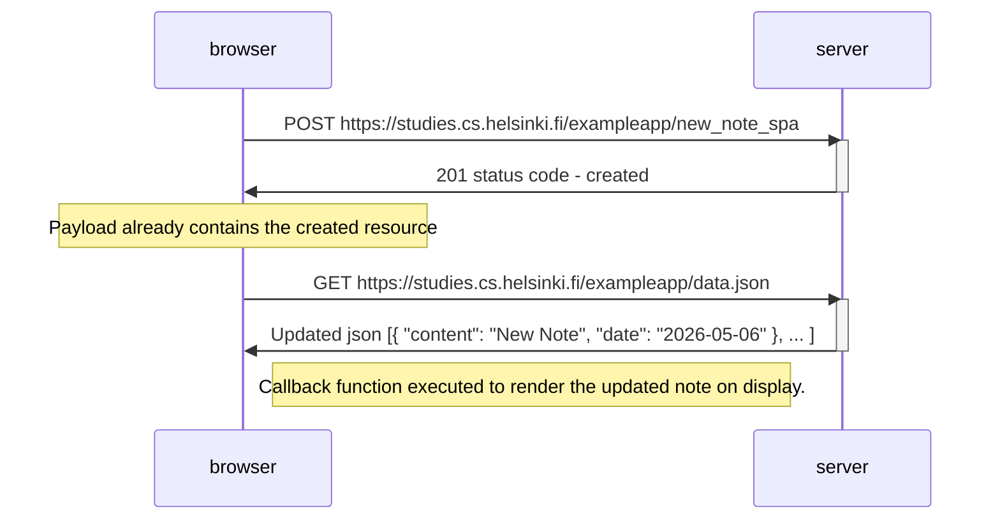

```mermaid
sequenceDiagram
participant browser
participant server

browser ->> server: POST https://studies.cs.helsinki.fi/exampleapp/new_note_spa
activate server
server ->> browser: 201 status code - created 
deactivate server

Note over browser : Payload already contains the created resource  

browser ->> server: GET https://studies.cs.helsinki.fi/exampleapp/data.json
activate server
server ->> browser: Updated json [{ "content": "New Note", "date": "2026-05-06" }, ... ]  
deactivate server

Note right of browser: Callback function executed to render the updated note on display. 

```